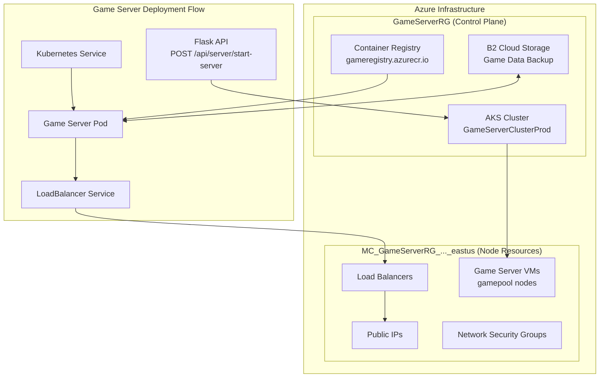
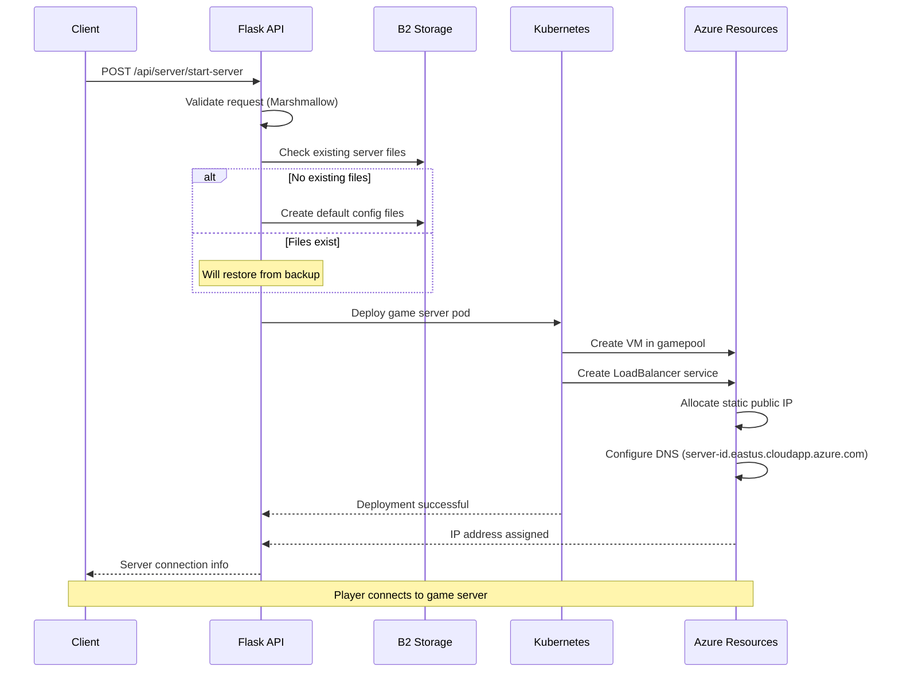
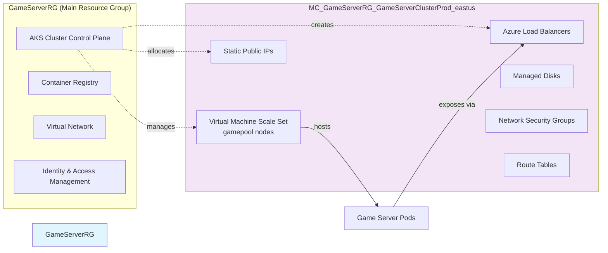
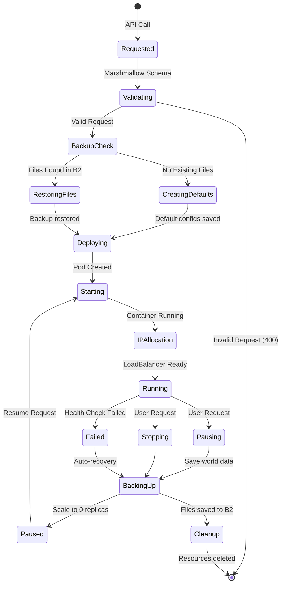

# Game Server Backend (Python + Flask)

A Flask-based backend service for managing game server deployments on Azure Kubernetes Service (AKS). This service provides RESTful APIs to start, stop, and manage game servers with different resource configurations.

## Features
- Deploy game servers to AKS with configurable resource packages
- Support for multiple game types (Minecraft, Enshrouded, etc.)
- Azure AD authentication integration
- RESTful API endpoints for server management
- Kubernetes-based container orchestration
- Legacy support for Azure Container Instances (ACI)

## Prerequisites

- Python 3.12 or higher ()
- Azure CLI
- kubectl
- Azure subscription with AKS cluster
- Visual Studio Code (recommended)

## Local Development Setup

1. Clone the repository:
   ```bash
   git clone <repo-url>
   cd game-server-backend
   ```

2. Create and activate virtual environment:
   ```bash
   # Create venv
   python -m venv venv

   # Activate venv (Windows)
   venv\Scripts\activate
   ```

3. Install dependencies:
   ```bash
   pip install -r requirements.txt
   ```

4. Install Azure CLI tools:
   ```bash
   # Install Azure CLI if not already installed
   az aks install-cli
   ```

5. Configure Azure and Kubernetes credentials:
   ```bash
   # Login to Azure
   az login

   # Get AKS credentials
   az aks get-credentials --name GameServerClusterProd --resource-group GameServerRG --overwrite-existing

   # Convert kubeconfig for AAD authentication
   C:\Users\<username>\.azure-kubelogin\kubelogin.exe convert-kubeconfig
   ```

6. Create `.env` file:
   ```plaintext
   ENVIRONMENT=development
   AZURE_SUBSCRIPTION_ID=your-subscription-id
   AZURE_RESOURCE_GROUP_NAME=GameServerRG
   PORT=5000
   KUBECONFIG_CONTENT=<base64-encoded-kubeconfig>
   ```

7. Start the Flask application:
   ```bash
   python app.py
   ```

## Project Structure
game-server-backend/
├── app.py # Main Flask application
├── requirements.txt # Python dependencies
├── .env # Environment variables
├── routes/ # API route definitions
│ ├── init.py # Blueprint registration
│ ├── server_routes.py # Server management endpoints
│ ├── game_routes.py # Game information endpoints
│ └── user_routes.py # User management endpoints
├── services/ # Business logic
│ └── kubernetes_service.py # K8s integration
└── utils/ # Helper utilities
└── kubernetes_deployment_builder.py # K8s YAML generation

## Architecture

### Infrastructure Overview



### Request Flow



### Resource Group Architecture



### Game Server Lifecycle



## API Endpoints

### Server Management
- `POST /api/server/start-server`: Start a new game server
- `POST /api/server/stop-server`: Stop a running server
- Legacy ACI endpoints:
  - `POST /start-server`
  - `POST /stop-server`
  - `GET /server-status/<server_id>`

### Game Information
- `GET /api/game/info/<game>`: Get game configuration details

### User Management
- `GET /api/user/info`: Get user information
- `GET /api/user/servers`: List user's servers

## Testing

### API Testing with Postman

1. Start a game server:
   ```http
   POST http://localhost:5000/api/server/start-server
   Content-Type: application/json

   {
       "package": "standard",
       "server_id": "minecraft-server-001",
       "namespace": "default"
   }
   ```

2. Check deployment in Azure Portal:
   - Navigate to Azure Kubernetes Service > GameServerClusterProd
   - Check Workloads > Deployments

3. Monitor with kubectl:
   ```bash
   # View nodes
   kubectl get nodes

   # View deployments
   kubectl get deployments -n default

   # View pods
   kubectl get pods -n default
   ```

## Game Packages

Currently supported package configurations:

json
"standard": {
"cpu": 2000, # 2 cores
"memory": 6144, # 6 GB in MiB
"image": "gameregistry.azurecr.io/minecraft-server:latest",
"port": 25565,
"env_vars": {
"EULA": "TRUE",
"MEMORY": "5G",
"SERVER_NAME": "Azure Test Minecraft Server"
}
}

## Deployment

The application is configured for deployment to Azure App Service via GitHub Actions. The workflow is defined in `.github/workflows/main_game-server-backend.yml` and includes:
- Python 3.12 setup
- Dependencies installation
- Build and deployment to Azure Web App
- Azure authentication using managed identity

## Common Issues and Solutions

1. Kubelogin not found:
   - Run `az aks install-cli`
   - Update kubeconfig with full path to kubelogin.exe

2. Authentication errors:
   - Run `az login`
   - Get fresh credentials with `az aks get-credentials`

3. Virtual Environment Issues:
   - Ensure you're in the correct directory
   - Activate venv before installing dependencies
   - Use the correct activation script for your OS

4. Azure Portal Access:
   - Workloads: Azure Portal > Kubernetes Services > GameServerClusterProd > Workloads
   - Monitoring: Azure Portal > Kubernetes Services > GameServerClusterProd > Insights

## Environment Variables

Required environment variables in `.env` and Azure App Service:
- `AZURE_SUBSCRIPTION_ID`: Your Azure subscription ID
- `AZURE_RESOURCE_GROUP_NAME`: Resource group containing AKS cluster
- `KUBECONFIG`: Path to your kubeconfig file
- `B2_KEY_ID`: Backblaze B2 key ID
- `B2_KEY_NAME`: Backblaze B2 key name
- `B2_APP_KEY`: Backblaze B2 application key

## License

MIT License